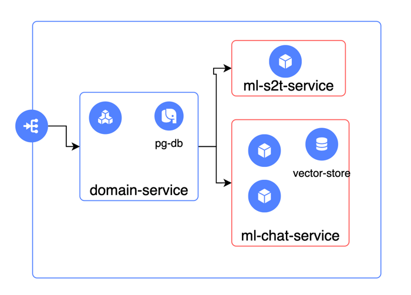

# Airina-tinkoff-hack


## Введение

Современный бизнес сталкивается с постоянной необходимостью мгновенного доступа к информации и оперативной поддержки в различных вопросах ведения бизнеса. Особенно это касается новых и текущих пользователей, которым требуется круглосуточная помощь в решении типовых задач и вопросов, связанных с кредитованием, бухгалтерским учетом, государственными закупками и другими аспектами ведения бизнеса. Это создает дополнительную нагрузку на операторов и замедляет процесс предоставления необходимой информации.

## Тизер решения
Чтобы решить эту проблему, мы  создали генеративного ассистента (бота-помощника), опираясь на текущую базу знаний "Тинькофф Помощь. Бизнес". Бот-помощник будет доступен  пользователям (предпринимателям), предоставляя моментальные ответы на их вопросы.

## Сборка и запуск приложения
```powershell
docker compose --env-file .env up --build -d
```

После запуска требуется добавить в директорию `/app/data` контейнера `backend` файлы с КСР и векторными представлениями наименований. В дальнейшем это будет осуществляться в автоматическом режиме. 


## Архитектура



## Используемые технологии
Чтобы создать бота-помощника, мы используем передовые инструменты и технологии:
* LLM (Large Language Models): Мы используем большие языковые модели, такие как GPT-3 или BERT, для обработки естественного языка и генерации ответов.
* LangСhain: Платформа для создания и развертывания приложений, основанных на обработке естественного языка.
* LangSmith: Платформа для обучения и тонкой настройки LLMs, разработанная специально для создания чат-ботов и ботов-помощников.
* Hugging Face: Компания, предоставляющая набор инструментов и библиотек для обработки естественного языка, которые широко используются в индустрии.
* SBert: Метод, используемый для получения семантических представлений предложений, которые могут быть использованы для сравнения и поиска похожих предложений.
* Ollama: Библиотека для обработки естественного языка, которая специализируется на анализе настроения, эмоций и субъективности текста.
* Chroma db: База знаний, специально созданная для хранения и извлечения информации, необходимой для бота-помощника.

## Метрики и лидерборд
Для оценки эффективности бота-помощника мы будем использовать различные метрики, включая точность ответов, время ответа, рейтинг полезности ответов и душность ответа. Эти метрики будут представлены в удобном лидерборде, позволяя нам отслеживать эффективность бота и постоянно улучшать его работу.

## Заключение

Создание генеративного ассистента (бота-помощника) на основе текущей базы знаний "Тинькофф Помощь. Бизнес" позволит нам обеспечить  пользователей оперативной поддержкой в различных вопросах ведения бизнеса. Используя передовые инструменты и технологии, мы сможем создать эффективного и полезного бота-помощника, который будет постоянно улучшаться и развиваться вместе с потребностями наших пользователей.
