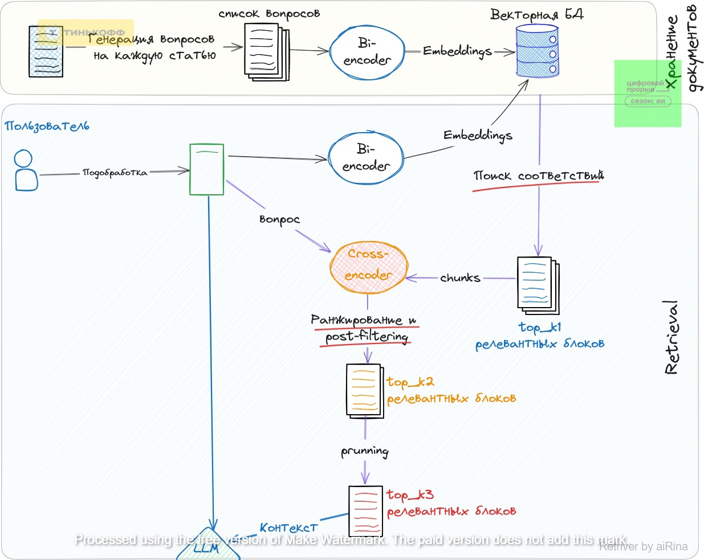
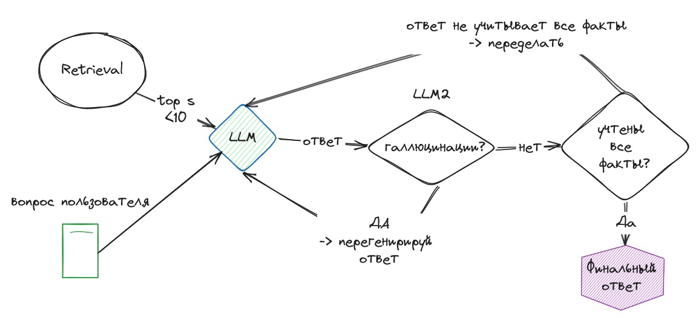

# Airina-tinkoff-hack


## Ссылка на API
http://158.160.164.237:8080
## Введение

Современный бизнес сталкивается с постоянной необходимостью мгновенного доступа к информации и оперативной поддержки в различных вопросах ведения бизнеса. Особенно это касается новых и текущих пользователей, которым требуется круглосуточная помощь в решении типовых задач и вопросов, связанных с кредитованием, бухгалтерским учетом, государственными закупками и другими аспектами ведения бизнеса. Это создает дополнительную нагрузку на операторов и замедляет процесс предоставления необходимой информации.

## Тизер решения
Чтобы решить эту проблему, мы  создали генеративного ассистента (бота-помощника), опираясь на текущую базу знаний "Тинькофф Помощь. Бизнес". Бот-помощник будет доступен  пользователям, предоставляя моментальные ответы на их вопросы.

## Сборка и запуск приложения  
Генерация файлов  с переменными окружения
```powershell
make env
```
Запуск приложения
```powershell
make up
```


## Архитектура LLM на основе ритривере

## Алгоритм ритривера:
1. Каждую статью бьем на блоки
2. На каждый блок генерируем вопросы
3. На основе вопроса пользователя сначала подбираем блоки (~150шт) по сгенерированным вопросам
4. Сокращаем количество блоков до 10
5. Убираем не релевантные блоки (pruning)
6. Передаем в LLM..



## Алгоритм работы LLM на основе ритривера:
1. В LLM передается части статей (chunks), которых менее 10 с учетом prunning
2. LLM генерирует первичный ответ
3. Первичный ответ проверяется на галлюцинации
4. Первичный ответ проверяется на полноту
5. Финал

## Используемые технологии
Чтобы создать бота-помощника, мы используем передовые инструменты и технологии:
* BAAI/bge-m3: Эмбединг модель
* LangСhain: Платформа для создания и развертывания приложений, основанных на обработке естественного языка.
* Cohere Rerank: Специализированная платформа для обучения и настройки языковых моделей, предназначенных для создания чат-ботов и виртуальных помощников. Она позволяет разработчикам обучать модели для конкретных задач и улучшать их эффективность.
* Chroma db: Векторная база данных

## Метрики и лидерборд
Для оценки эффективности бота-помощника мы будем использовать различные метрики, включая точность ответов, время ответа и душность ответа.

## Заключение

Создание генеративного ассистента (бота-помощника) на основе текущей базы знаний "Тинькофф Помощь. Бизнес" позволит нам обеспечить  пользователей оперативной поддержкой в различных вопросах ведения бизнеса. Используя передовые инструменты и технологии, мы сможем создать эффективного и полезного бота-помощника, который будет постоянно улучшаться и развиваться вместе с потребностями наших пользователей.
